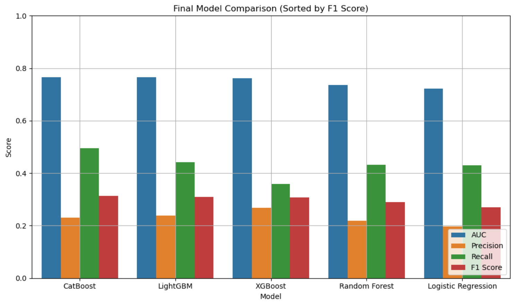
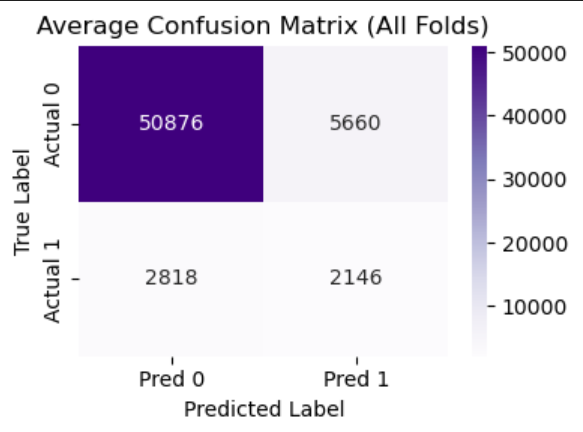
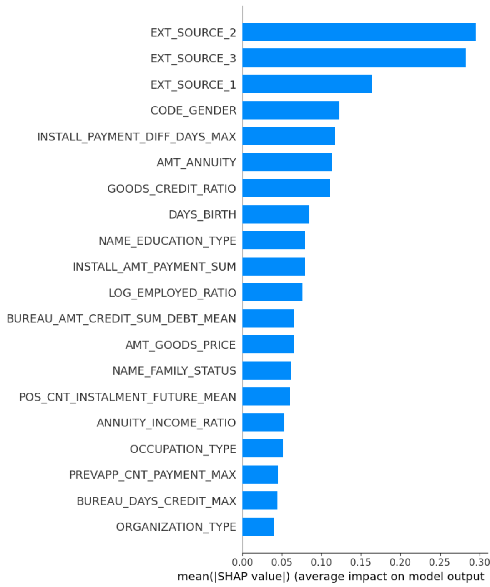
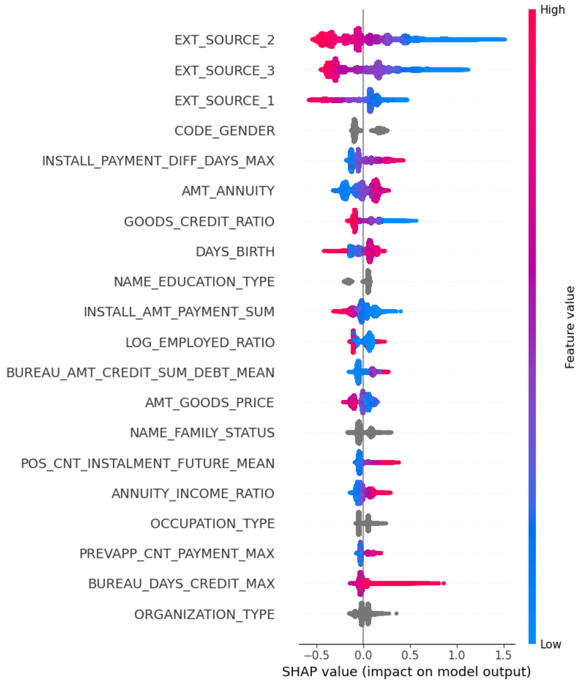
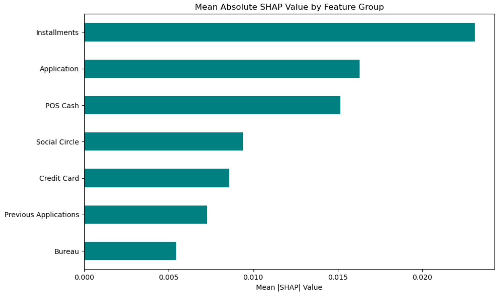
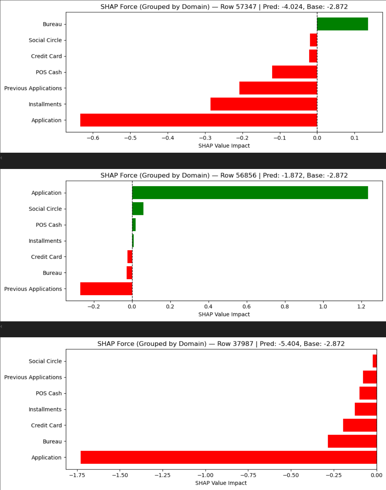

# Final Modeling Report – Home Credit Default Risk

## 1. Objective

To build a machine learning model that accurately predicts the likelihood of a loan applicant experiencing payment difficulties. The model serves as a decision-support tool for credit approval, with a strong emphasis on recall due to the higher cost of false negatives in the lending domain.

---

## 2. Business Context

In credit risk modeling:
- **False negatives (missed defaulters)** are costlier than false positives.
- Therefore, **recall** was prioritized throughout the modeling process.
- Additional metrics like AUC, precision, and F1 score were tracked for balance and optimization.

---

## 3. Data Pipeline Summary

- **Training size:** 307,511 loans  
- **Tables used:** 7 relational files merged on `SK_ID_CURR` or `SK_ID_PREV`
- **Final dataset:** ~380 engineered features derived from application data, credit history, previous applications, card and installment balances, and repayment behavior

---

## 4. Feature Engineering Highlights

- Ratio features: `CREDIT_TO_INCOME`, `ANNUITY_TO_INCOME`, `EMPLOYED_BIRTH_RATIO`
- External risk scores: `EXT_SOURCE_1`, `EXT_SOURCE_2`, `EXT_SOURCE_3` (top predictors)
- Approval metrics: `APPROVAL_RATE`, `NUM_PREV_APPS`
- Repayment delay ratios and completion metrics from installments
- All features aggregated using `.groupby('SK_ID_CURR')` followed by statistical summaries

**Reference:** See `Feature_Engineering_Notes.md` for complete feature list and rationale.

---

## 5. Modeling Strategy

### Step 1: Sample Dataset Benchmarking

| Model               | AUC   | Recall | Precision | F1 Score |
|--------------------|-------|--------|-----------|----------|
| CatBoost           | 0.779 | 0.583  | 0.327     | 0.415    |
| LightGBM           | 0.776 | 0.546  | 0.349     | 0.425    |
| XGBoost            | 0.774 | 0.512  | 0.321     | 0.395    |
| Random Forest      | 0.767 | 0.528  | 0.312     | 0.392    |
| Logistic Regression| 0.772 | 0.511  | 0.324     | 0.396    |

**Outcome:** CatBoost was selected for its superior recall and categorical support.

  

---

### Step 2: Full Model (CatBoost)

- Hyperparameter tuning via **Optuna**: optimized `learning_rate`, `depth`, `l2_leaf_reg`
- **Stratified K-Fold CV** (k=5) used to maintain target distribution across folds
- Post-training **threshold tuning** identified optimal F1 score at a threshold of 0.15

| Metric    | Value |
|-----------|-------|
| AUC       | 0.778 |
| Recall    | 0.683 |
| Precision | 0.328 |
| F1 Score  | 0.446 |
| Threshold | 0.15  |

> Scaling to the full dataset and enriching the feature set improved recall by ~10 percentage points.

  

---

## 6. Explainability (SHAP Analysis)

### Global SHAP Insights:
- Most important features: `EXT_SOURCE_2`, `EXT_SOURCE_3`
- Application-level features contributed the most raw impact

  

  

---

### Domain-Level SHAP Grouping:
Grouped SHAP revealed:
- Application features = majority influence
- Installments + previous applications = stronger effect on defaulters
- Bureau and social circle = modest but consistent signal

  

---

### Local SHAP (Force Plots):
- Helped validate individual risky predictions
- Often tied to low external scores and high annuity burdens

  

---

## 7. Final Model Output

- Final CatBoost model retrained on all available training data with best Optuna parameters
- Threshold 0.15 applied for classification
- Test set predictions exported with probability column (`TARGET_PROB`) for external evaluation or production use

---

## 8. Reproducibility

- Environment tracked via `environment.yml`
- All notebooks runnable in order:
  1. `1_EDA_FeatureEngineering.ipynb`
  2. `2_Modeling_CatBoost.ipynb`
  3. `3_Evaluation_Thresholding_SHAP.ipynb`
  4. `4_TestPrediction_Submission.ipynb`

---

## 9. Conclusions

- CatBoost consistently outperformed other models on both sample and full data
- Feature engineering meaningfully boosted recall and interpretability
- Threshold tuning was crucial to align model output with business priorities
- SHAP tools provided transparency needed for financial risk environments

---

## 10. Recommendations

- Monitor model drift with time-based validation
- Consider deployment with API (e.g., FastAPI)
- Evaluate more complex ensembling or TabNet
- Incorporate cost-sensitive learning if real-world cost matrices are available
